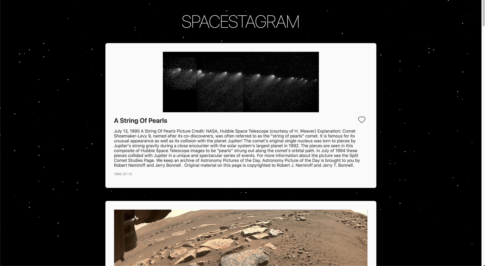

# Spacestagram 🚀

Shopify Front End Developer Intern Challenge - Summer 2022



Check it out here!

## Getting Started

### Prerequisites

- [node](https://nodejs.org/en/download/)

### Installation

1. Clone the repo

   ```sh
   git clone https://github.com/dryu99/spacestagram.git
   ```

2. Install NPM packages

   ```sh
   npm install
   ```

   or

   ```sh
   yarn
   ```

3. Get a free API key at [https://api.nasa.gov/](https://api.nasa.gov/)
4. Create an `.env` file in the project's root directory with your API key

   ```
   NASA_API_KEY=<YOUR_API_KEY>
   ```

### Development

1. Start the application

   ```sh
   yarn dev
   ```

2. View the application at [http://localhost:8080](http://localhost:8080)

## Features

### MVP requirements

- Fetch data from one of [NASA's APIs](https://api.nasa.gov) and display resulting images
- Each image result should list at least a title, date of capture (ideally in earth_date) and a button to “like” that image
- Each image can be “liked”, and a user should be able to undo their “like”
- The HTML that ends up being served client-side should be accessible and semantic ([MDN reference](https://developer.mozilla.org/en-US/docs/Learn/Accessibility/HTML))

### Additional features

- Implemented **infinite scrolling** to allow users to improve content discovery and the associated user experience
- Added a **parallax star background** to create a soothing and immersive user experience ✨

### Future Improvements

- **Server side rendering**: Rendering resources on the server before serving the page to the client would help improve SEO and reduce the number of network requests needed on initial page load.
- **Virtual rendering**: A drawback from infinite scrolling is that performance will eventually degrade as the user continues to scroll down and grow the DOM tree. Virtually rendering the list of posts will ensure only those DOM elements that appear in the viewport will actually be in in the DOM tree. This will keep the tree lean and the site snappy.
  - Part of this task also involves addressing the negative implications from using virtual rendering e.g. losing native search
- **Unit/Integration/E2E tests**: I opted to not write tests for the sake of rapidly developing an MVP. After finalizing a good design, we can start writing tests to validate the behaviour of the app and catch regressions.

## Tech Stack

- [Svelte](https://svelte.dev/): I've never used Svelte before and saw this as a good opportunity to try it out! I appreciated its concise syntax, lean bundle size, and amazing documentation.
- [TypeScript](https://www.typescriptlang.org/): I'm a big advocate for TypeScript for how much it speeds up development through its type checking, improved refactoring, and compile-time errors.